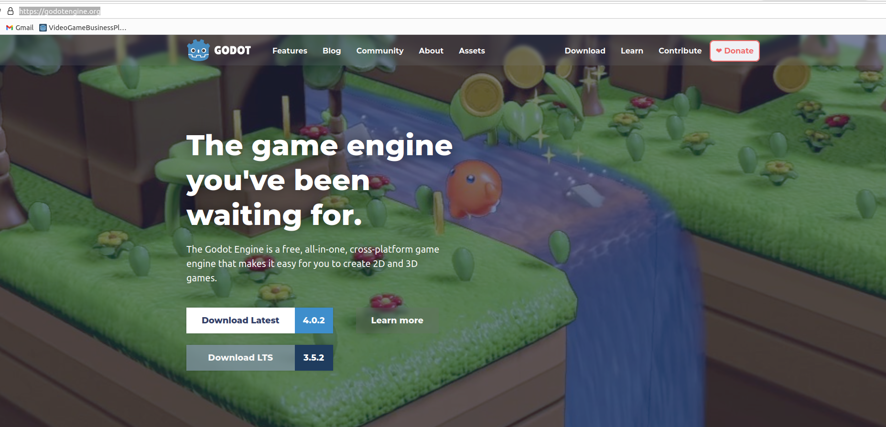
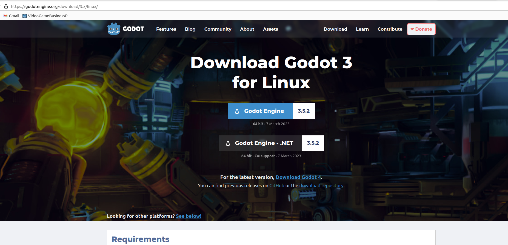
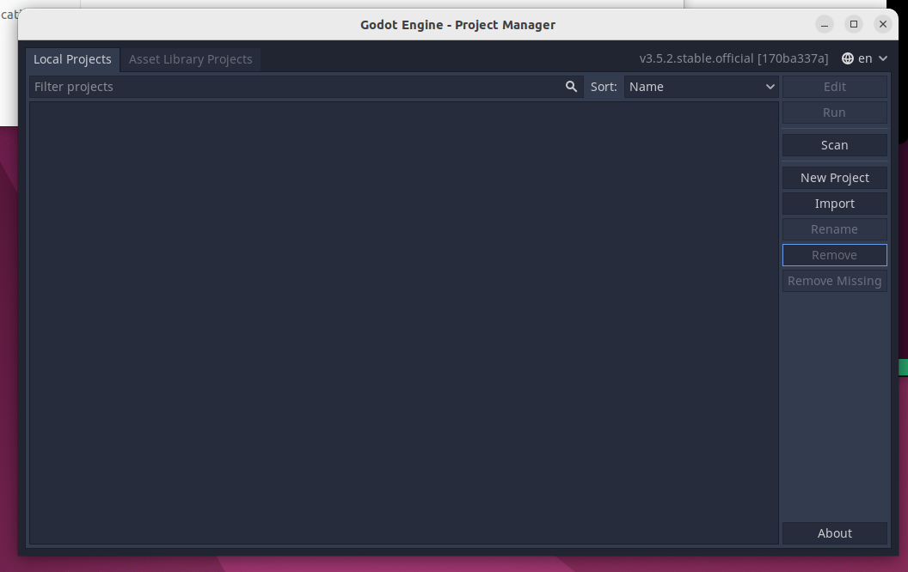
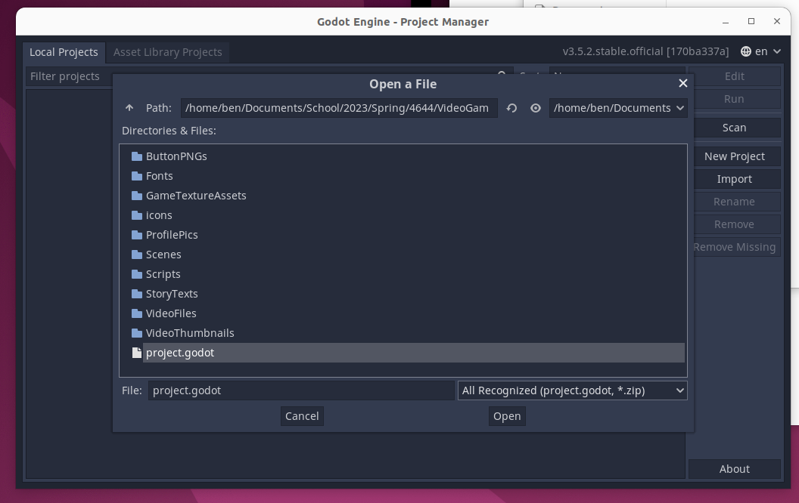
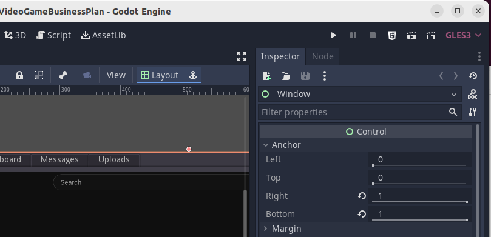

# Parasocial Instructions

Hello! This is our project for our Spring 2023 Creative Computing Capstone.

## Table of Contents
1. [Running Instructions](#running-instructions)
2. [Technical Difficulties](#technical-difficulties)
3. [Credits](#credits)

## Running Instructions
For reasons covered in the [Technical Difficulties](#technical-difficulties) portion, we cannot build this project into an HTML5 project, meaning, to run our project, you will have to download a version of Godot and import it. Please follow along!

### 1. Downloading Godot
1. Please navigate to the Godot webpage listed [here](https://godotengine.org/). You should see a screen that gives you download options depending on your machine. Our current project was created in **Godotv3.5.2**, meaning we will look to install that. As of Spring 2023, this can be found by downloading the current Long Term Support (LTS) version. Refer to the image below to make sure you're in the right place:

2. After clicking the LTS version, you should be brought to a page that offers you downloads accoridng to your machine. We are going to use Godot Engine, *not* Godot Engine .NET with C# support. Please download that. 

3. Please place the downloaded zip you recieved wherever you prefer and unzip to get an executable.

4. Now, run the executable. You should get a screen like shown below. This is known as the project manager. We are going to try and import a project here after we get it.

5. Now, we need to get our project. Please clone this repository if you like, or, if you prefer, download the zip file at the base level of the repository and unzip it whereever you prefer.

6. Now that you have the contents of the repository, you are going to want to go back to your instance of the Godot Editor, and click `import`. We are going to specify the path to the `project.godot` file, which should be the child of the parent directory of our unzipped our cloned repo. Click `open` and then `Import&Edit`.

7. Now we should have the project open. The only remaining step is to click the `play button` in the top-right row of buttons on the window. This will run our game. Enjoy!

8. Just a heads up!! If there are any technical difficulties playing the game from the zip file, consider just using the forked repo.

## Technical Difficulties
It should be noted that we ran into a couple major issues when making our game that are related to the Godot Engine and some growing pains.

- ***webm video playing support***
Godot's newest version, Godotv4, no longer supports the use of webm files in the video player in Godot. This is due to its unreliable nature. Godot struggles to play these videos consistently and will sometimes just freeze them at certain points. It seems to occur randomly, and there is no known fix. *.ogv* support has been expanded in the new versions which seems to fix it, but porting our project led to some additional issues which we did not have time to fix.

- ***building and resource access issues***
Godot's resource management from scripts is currently relatively unreliable when building. Some interaction between compiled components of the project and outside resources has been limited, and, since our game relies on reading from text files as well as video and images, building broke it in its current state. We have looked in to solutions, but there currently aren't too many viable ones for this version.

As of now, it seems like the game making process would have gone significantly more smoothly had we used a more established editor, such as Unity. Perhaps it would have been even *easier* had we simply programmed a website for the game.

## Credits
- Rio Young
- Madeleine Houser
- Jamie Sloop
- Benjamin Altermatt
